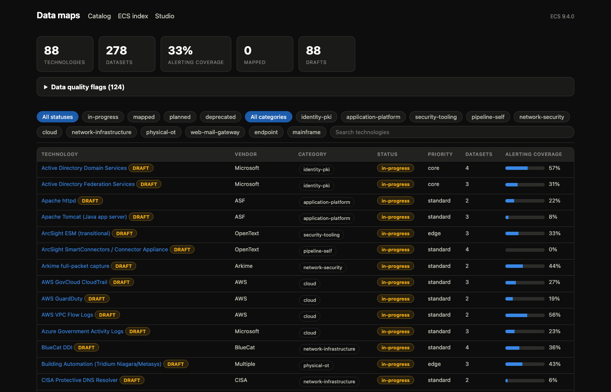
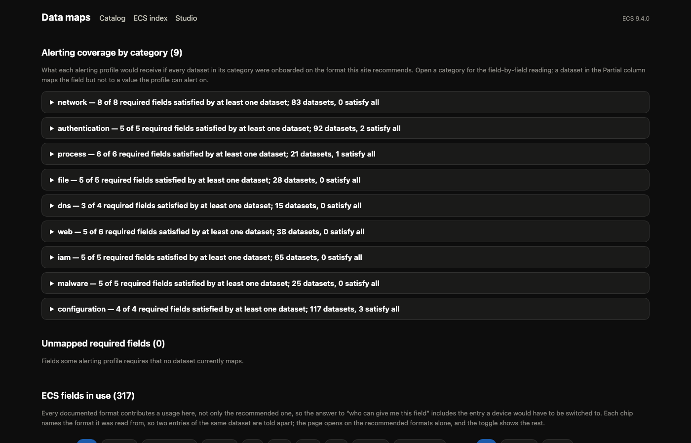
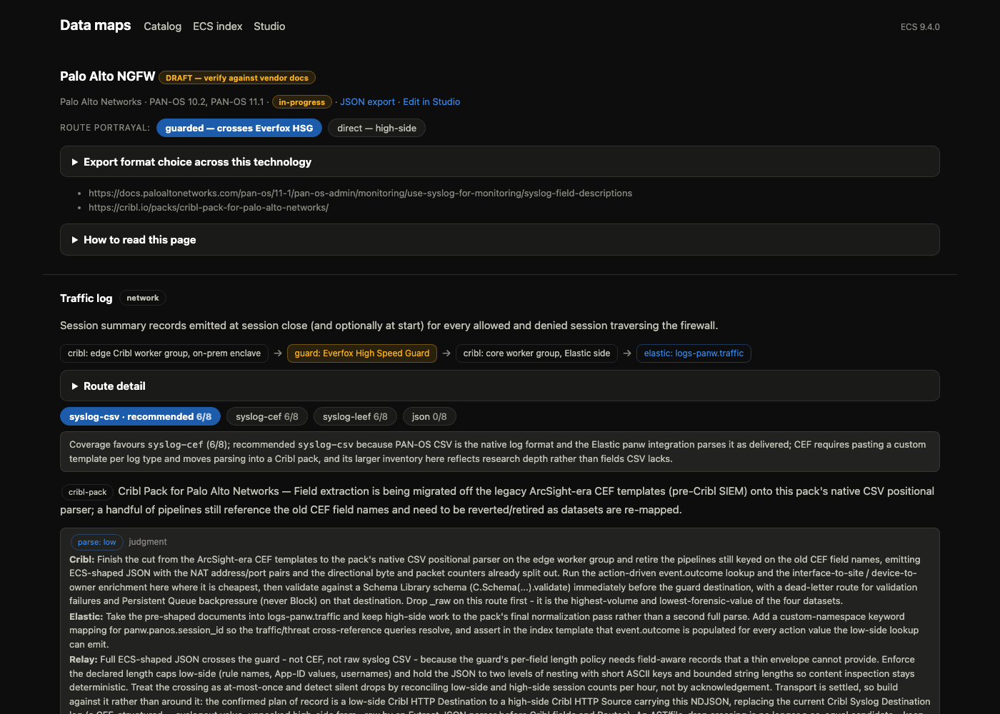
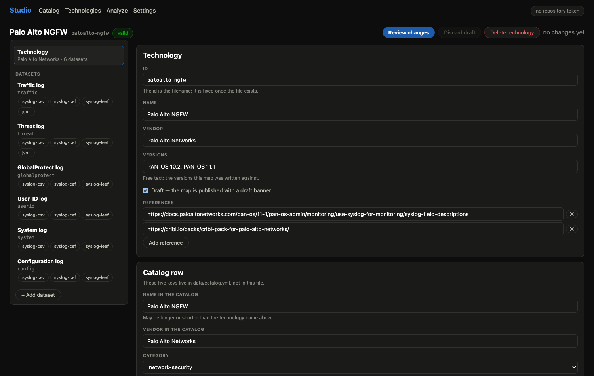

# Data Maps

A catalog of **how our log sources map to the Elastic Common Schema
(ECS)** — one page per technology, covering every log type (dataset) we
ingest: the vendor's real field names, their ECS targets, how each feed
moves through the pipeline (Cribl worker groups and the cross-domain
guard), how it gets parsed, and what work remains on each side. The
catalog is authored as YAML in this repository and published as a static
GitLab Pages site with JSON exports, a printable view, Studio, a browser
editor and log-analysis workbench, and the Picker, which hands a consumer
one feed's map together with its Cribl pipeline or an Elasticsearch ingest
pipeline translated from it.

**Who it serves**

- **Device Owners** — see exactly how your technology's data lands in
  Kibana, which fields are mapped, and what parsing strategy applies, so
  you can plan and verify your migration off ArcSight, and maintain your
  own map through Studio without touching YAML.
- **CSOC** — see which alerting-required ECS fields each dataset can and
  cannot satisfy, with the gaps stated per field, so detections are
  built on fields that actually exist.
- **Pipeline engineers** — per-dataset Cribl and Elastic work
  recommendations, including how each feed crosses the guard.

*The catalog. Coverage is per technology and the counters are live — this
is a migration in progress, not a finished one.*

**Documentation.** This README is the reference. The **wiki** is the
how-to: a walkthrough for adding a technology, task-shaped Studio guides,
operational runbooks, symptom-first troubleshooting and a glossary. Its
source is `docs/wiki/`, published with `tools/wiki.py`.

---

## What this repository is — and is not

This is the section for anyone uneasy about hosting this material in
GitLab. The repository contains **documentation about log structure,
not logs**:

- **Log data only as deliberate single records.** The repository may
  contain example log records captured from the deployed environment —
  one or a few per dataset, as `.log` sidecar files, committed
  deliberately and reviewed in merge request like all other content.
  The safety argument is same-enclave: this GitLab runs inside the
  enclave that already stores this same data operationally at full
  volume, so a handful of curated records add no new exposure class.
  Everything else here remains *field names* as published in vendor
  documentation (for example, "PAN-OS traffic logs have a field called
  `src`") and their standard ECS equivalents.
- **No secrets.** No credentials, tokens, keys, or connection strings.
  The build is a pure file-in/file-out transformation; CI needs no
  privileged access to any production system.
- **No reachability information in the maps.** Routes name pipeline
  *tiers* (edge worker group, guard, core worker group, Elastic), not
  hostnames, IP addresses, or ports of real infrastructure. Example
  records are the exception and can name internal hosts and addresses,
  exactly as the operational data stores in this enclave already do.
- **Vendor-public content.** The field inventories are drawn from
  publicly published vendor documentation and Elastic's own open-source
  integrations. Where a product's documentation is controlled (for
  example, the cross-domain guard), the map deliberately contains
  clearly labeled *placeholder* field names and says so — the controlled
  detail stays in its controlled documentation.

### Example records

    data/examples/<tech-id>/<dataset-id>.log
    data/examples/<tech-id>/<dataset-id>-<label>.log

The directory is a catalog technology id and the file stem is one of
that technology's dataset ids, optionally followed by `-<label>` (the
label renders with hyphens as spaces; a bare dataset id renders as
"example"). Dataset ids contain hyphens, so the stem is resolved by
longest prefix and the prefix must end at the stem's end or at a `-`.
A directory or stem that resolves to nothing is a **hard error** — a
typo fails the build rather than silently unpublishing a record.

- The extension is always `.log` whatever the record's format: it means
  "raw record, publish verbatim, do not lint".
- One file is one example blob. Multi-line records (Windows event XML,
  DMARC XML, pretty-printed JSON) are fine.
- Real captured records are committed **on the internal GitLab only**. This
  repository builds identically with no `data/examples/` at all, which
  is the normal state of any copy outside the enclave.
- `everfox-hsg` takes **no** examples. Its map is deliberately
  placeholder because the product's documentation is controlled, and a
  real guard audit record would defeat that; the build rejects one.
- Empty files and files over 256 KB publish but raise a data-quality
  flag asking for a representative record.

What the repository *does* record is internal engineering context:
which technologies we ingest, that a cross-domain guard exists in the
architecture, and our parsing decisions. That is ordinary
architecture-documentation sensitivity — the same class of content as a
design document or wiki page — and it is why this lives on the
**internal, access-controlled GitLab**, not a public host. Repository
permissions govern who can read it; merge requests govern who can
change it.

### Why GitLab is the right home

The alternative to hosting this well is not "not hosting it" — it is
spreadsheets and tribal knowledge. Version control makes this material
*safer* and more trustworthy, not less:

- **Single source of truth.** One reviewed catalog instead of competing
  spreadsheet copies with silent divergence.
- **Full audit trail.** Every change to every field mapping is a commit
  with an author, a timestamp, and a diff. You can answer "who changed
  this mapping and when" forever.
- **Reviewed change.** Edits arrive as merge requests. Nothing reaches
  the published site without passing validation and review.
- **Machine-checked correctness.** CI validates every change against
  the schema and the vendored ECS dictionary before it can publish — a
  typo'd field name *fails the build* instead of quietly poisoning a
  dashboard.
- **Reproducible output.** The site is generated deterministically from
  the YAML. Delete `public/` and rebuild: byte-identical. There is no
  hand-edited state to drift.
- **Exportable.** The catalog and its derived views are also published
  as JSON under `exports/` — per technology, the whole catalog, the
  alerting matrix and the ECS index — so other tools can consume the
  catalog without scraping pages. The data-quality flags and the
  switch-gain lines are page-only.

---

## The published site

- **Index** — all technologies with status, category and priority
  filters, search, migration coverage, and the data-quality flag panel.
- **Technology pages** — one page per technology, one section per
  dataset (see the reading guide below; the same guide renders on every
  technology page as a collapsible "How to read this page" panel).
- **ECS index** — the reverse view, written for the CSOC. It opens on
  **Alerting coverage by category**: one collapsible table per alerting
  profile, one row per required field, with the datasets in that
  category that satisfy the field on their recommended format, those
  that reach it only partially, and those that miss it, each as a chip
  linking to the dataset. Then the gap lists: alerting-required fields
  no recommended format maps. **Unmapped required fields** comes first —
  the ones no documented format of any dataset maps at all — and
  **Closable by switching format** follows, for the ones another
  documented format of the same dataset does map, where closing the gap
  is an export-configuration change rather than new mapping work. That
  second section is drawn only when it has something in it; both lists
  are empty today. Last is the field table: every ECS field
  in use, a **required** badge naming the categories whose profile
  requires it, and a chip per usage. Every documented format
  contributes a usage, not only the recommended one, so the table also
  answers "which format would give me this field"; the recommended
  format's chips are styled apart and the page opens with the
  **recommended format only** toggle on. A filter row narrows the chips
  by alerting category, by mapping status, and by that toggle.
- **Print view** — every page carries print styles for clean hard-copy
  or PDF output.
- **Exports** — one JSON file per technology plus three aggregates
  (`catalog.json`, `alerting.json`, `ecs-index.json`) under `exports/`,
  each carrying `"schema_version": 1`. The per-technology file is the
  whole document, every field marked `alerting_required`, and each
  dataset carrying its `recommendation` and a `coverage` block;
  `catalog.json` is every catalog row with computed coverage, plus a
  `datasets[]` list of every dataset with its recommendation and
  coverage; `alerting.json` is the profiles and the alerting matrix; and
  `ecs-index.json` is every ECS field with `required_in` and its usages.
- **Studio** — a browser editor for the catalog and a log-analysis
  workbench, served at `studio/` and linked from the header of every
  page. Edits leave as merge requests, so review stays the gate; see
  [Studio](#studio) below.
- **Picker** — the consumer entry point at `picker.html`, also linked from
  the header: pick a technology, a dataset and the wire format you have,
  say whether Cribl Stream is in your path, and take away that block's map
  plus the pipeline that parses it; see [The Picker](#the-picker) below.

*The ECS index, written for the CSOC: which alerting-required fields each
category can actually satisfy, and which nothing maps yet.*

### Reading a technology page

Top of the page: the technology name (with a **DRAFT badge** when the
map is researched but not yet verified against the deployed system),
vendor and status, a link to the JSON export, the source references the
research is built on, and the **route-portrayal toggle**. The toggle is
the most important control to understand: every technology has
instances in both enclaves, so each side describes a **separate feed,
not a configuration choice** — *guarded* is the low-side feed that
crosses the Everfox guard on its way to Elastic; *direct* is the
high-side feed that never crosses. The choice persists as you move
between pages. A dataset marked *no CDS crossing* exists only on the
high side and shows a single route.

*A technology page. The chain under each dataset is the route the feed
actually takes; the format tabs carry the coverage each encoding reaches.*

When the technology's datasets between them offer more than one export
format, an **"Export format choice across this technology" panel**
sits above the datasets. It exists for appliances with a single export
configuration: when at least one format is offered by every dataset on
the page, the panel tabulates every format the technology emits, with
the alerting-required fields it satisfies summed across the datasets
that offer it and how many datasets offer it — so the technology can
standardize on that format. Otherwise there is no such format, and the
panel states in a sentence that no single format is offered by every
dataset.

Each dataset section then reads top to bottom:

- **Route strip** — the pipeline path hop by hop. Each chip is a
  pipeline tier (source device, edge Cribl worker group, guard, core
  Cribl worker group, Elastic data stream), never a hostname.
- **Format buttons** (when the vendor offers more than one wire
  format) — each button carries its own score, alerting-required
  fields satisfied over total required (`syslog-cef · 5/10`). The one
  marked *recommended* is the best-covering format by that score —
  usually the highest, but a documented override can name a different
  one instead — and it is the one counted in coverage numbers and named
  as the recommendation in the exports; the rest are documented
  alternates for migration planning, and the ECS index lists their
  usages too, flagging the recommended one. Where an override is in
  force, a note under the selected format states both readings:
  *"Coverage favours `syslog-leef` (5/10); recommended `syslog-cef`
  because …"*. Everything below the buttons belongs to the selected
  format.
- **Enable note and per-format references** — how or when a format
  other than the recommendation is turned on, and the vendor
  documentation specific to that format.
- **Parsing chip** — the mechanism that structures the data (Elastic
  integration, Cribl pack or pipeline, Elastic ingest pipeline) and the
  named artifact.
- **Recommendation block** — the migration work for the selected side.
  The *parse* chip states where parsing happens in the pipeline (*low*
  = near the source, *high* = near Elastic, *hybrid* = split), tagged
  *doctrine* when that location follows the standing parse-placement
  rule for the format's mechanism, or *judgment* when the rule has no
  opinion on the case and an author set it by hand; where the authored
  location disagrees with what the rule would pick, the tag is
  highlighted and reads *doctrine says …*, naming the location the
  rule settles on instead. *Cribl* and *Elastic* lines carry each
  team's work; the *Relay* line appears only on the guarded side and
  covers what the feed needs from the guard crossing.
- **Coverage line** — alerting-required ECS fields satisfied by the
  selected format, then total fields mapped. Immediately below it, a
  **switching-to line** appears only where another documented format
  of the same dataset would satisfy more alerting-required fields than
  the recommendation does (9 datasets today), naming that format, how
  many more fields it would satisfy, and which ones; the line is
  suppressed while an override is in force, since the override's stated
  reason already answers why not to switch.
- **Field table** — the vendor's documented fields and their ECS homes:
  ECS target or fallback *custom* namespace, transform notes, mapping
  status (`mapped` / `partial` / `unmapped` — see *Mapping status*
  below), and an *Alerting* dot on fields a CSOC alerting profile
  requires (derived, never hand-authored).
- **Example record** — a real record from the deployed feed, collapsed
  by default, published byte-for-byte at `examples/<tech-id>/<file>`
  and linked from the block. Records over 32 KB are shown truncated
  inline; the download always serves every byte. The per-technology
  JSON export lists them as `examples: [{dataset, label, path}]`.

An **alternate format may legitimately carry no field table**, and when
it does the entry says why in `fields_omitted` — a required sentence
that renders as a *No field table* line in place of the table.
Recurring reasons: the vendor publishes that format's inventory only
behind a support login; the keys are an operator-defined payload
template rather than a fixed vendor list; or the format re-serializes
fields another entry on the same dataset already inventories. The key
is only valid on an empty `fields` list.

An alternate format with an empty `fields` list and **no**
`fields_omitted` is an authoring gap, and the build surfaces it as a
`format-no-fields` data-quality flag on the index.

### Studio

*Studio. A device owner maintains their own map through this form rather
than editing YAML, and every change leaves as a merge request.*

**Studio** is the site's editor: a page at `studio/` that runs entirely
in the browser, with no server component and no build step of its own.
The site header links to it, and every technology page carries an **Edit
in Studio** link straight to that technology. The editor covers the
whole schema — technology, datasets, routes, formats, recommendations,
field tables — across a picker at `#/`, the editor at
`#/tech/<id>`, the change review at `#/tech/<id>/review`, the delete
confirmation at `#/tech/<id>/delete`, log analysis at `#/analyze` and
settings at `#/settings`.

**First use**, for an admin with an account on the repository:

1. **Open Studio** from the site header; its own header carries a pill
   reading *no repository token* until the next step.
2. **Settings.** Paste the **Repository token**, and the **Analysis API
   key** too if the configured endpoint needs one; leave the URL fields
   empty to use what the site publishes. **Remember on this device**
   keeps the values in local storage rather than session storage.
3. **Pick a technology** from the searchable list, or start one with
   **New technology**; a row is badged *draft* where this browser holds
   unfinished work for it.
4. **Edit.** Validation runs on every change and the rail counts errors
   per section. The document autosaves as a draft in this browser, and
   reopening it offers a banner with **Resume** and **Discard**
   (autosave pauses until you choose) that also lists what changed
   upstream if the published file moved on meanwhile.
5. **Attach an example record**, optionally: each dataset section has an
   **Example records** panel listing what the site already publishes and
   offering **Attach a record** — paste one, or read it from a file,
   with an optional label. The Analyze screen offers the same thing for
   the sample already in the box once a dataset is named. Attached
   records are listed with the file they will create and travel with the
   draft until the merge request writes them.
6. **Review changes** — disabled while any validation error stands, its
   tooltip naming the first three and counting the rest. The screen
   shows the change list, the files to be written, and an editable
   branch name, commit message, MR title and description.
7. **Create merge request** runs five steps — *Check access*, *Check
   upstream*, *Create branch*, *Commit files*, *Open merge request* —
   each reporting itself; a failure names the step and shows the API's
   own status and body.
8. **The merge request link** appears on success, the draft is cleared,
   and the edited document becomes the new baseline.

*Check upstream* refuses to lose someone else's work, and its two
messages differ. *"… changed in the repository since this site was
built"* means the file moved on after the snapshot Studio holds and a
whole-file commit would revert it, and it says what to do: wait for the
rebuild, reload Studio so it reads the new snapshot, and make the change
again by hand — or use the YAML fallback and merge by hand. Reloading
matters because Studio keeps the snapshot it loaded at start-up, and the
drift it reports may already be published. Do not resume the older draft
at that point. Resuming restores the values the draft was written
against, which undoes the newer published edits, and *Check upstream*
does not catch that: the baseline it compares was loaded fresh, so it
matches the branch. The review screen marks every change that would
revert newer work, and the draft banner says so before you choose. *"… does not exist on `<branch>`"*
means the token may not read the file, or the site was built from
another branch — a rebuild will not help. Neither creates a branch, and
there is no "commit anyway".

**An attached record is evidence, not data.** Studio checks only the
shape — the dataset exists, the label is a slug, the stem does not
collide with a record already published or already attached, the file is
not empty, and the technology is not one that takes no records
(`everfox-hsg`); it warns above 256 KB, as the build does. Nothing can
tell a hostname from a customer name, so the merge request description
says *"Contains N example record(s): review for sensitive content before
merging"* and the reviewer is the check. The rule from *Example records*
above governs where that merge request may go: real captured records are
attached **on the internal GitLab only**, never from a copy of this site
outside the enclave.

**Review stays the gate.** Studio never writes to the default branch: an
edit arrives as a branch, one commit and a merge request through the
repository API (GitLab, or Forgejo when `repository.kind` says so), and
CI re-validates it like any other. Where that API is unavailable — a
workstation that blocks it, a token policy, a reviewer who wants the raw
file — the review screen's fallback offers a collapsible section per file with **Copy**,
**Download** and **Open in Web IDE**.

**Secrets live in the browser only.** The repository token, the analysis
API key and the Elastic API key are typed into Settings and kept in
session storage, or in local storage when "Remember on this device" is
on; "Forget everything" clears both. The repository holds endpoints and
nothing else, in `data/studio.yml`:

    repository.kind            gitlab | forgejo
    repository.api_url         API base (.../api/v4, .../api/v1)
    repository.project         GitLab path or Forgejo owner/repo
    repository.default_branch  the branch merge requests target
    repository.web_ide_url     Web IDE template ({project}/{branch}/{path})
    analysis.api_kind          openai | azure
    analysis.api_url           OpenAI-compatible base URL
    analysis.model             model, or Azure deployment name
    analysis.api_version       Azure only
    analysis.allow_override    false pins the analysis endpoint (default true)
    elastic.url                Elasticsearch base URL; empty disables the panel

Unknown keys are a hard error, as everywhere else in `data/`. Settings
carries an override for each of those non-secret values — repository API
URL, analysis URL, model, kind and api-version, and the Elastic URL — so
a workstation can point at the dev proxy below, or at another endpoint,
without a data change; an empty override leaves the published value
alone.

**The endpoint lock.** `analysis.allow_override: false` takes the
analysis URL, model, kind and api-version overrides away: Settings stops
drawing those fields and says *"This site fixes the analysis endpoint"*,
the saved values are ignored, and Analyze names the host each run will
go to. It is there so a site published where pasted logs must reach one
approved model cannot be quietly repointed at another from the browser.
Treat it as policy, not as a control: it constrains Studio's own UI, and
egress control on the network is what actually stops a log from leaving.
The API key stays an override in every case — it is a secret, so it can
only come from the browser.

**Point `data/studio.yml` at your own endpoints before publishing the
site.** The values here are examples, and they ship to whoever
serves `public/`: set `repository.*` to the repository this site's data
actually lives in, and `analysis.*` (and `elastic.url`, if you want that
panel) to endpoints you control. Two things decide whether they work
from a browser:

* **Mixed content.** A site served over HTTPS may not call an `http://`
  endpoint — the browser blocks the request outright, with no CORS error
  to read. A plain-HTTP analysis or Elasticsearch endpoint therefore
  needs to be behind TLS, or the site has to be served over HTTP too.
* **CORS.** Every endpoint is cross-origin from the pages host and has
  to say so. GitLab's and Forgejo's APIs do; OpenAI-compatible endpoints
  generally do; Elasticsearch does only with `http.cors.enabled` (plus
  `http.cors.allow-origin` and `allow-headers` for `Authorization`).

`tools/studio_dev.py` proxies both problems away locally, which is why a
misconfigured endpoint can look fine in development and fail on the
published site. The Elastic panel is optional because of the second
point, and says so when the browser blocks it.

**One repository, two sites: the deploy overrides the committed file.**
The build reads `data/studio.yml` and then lets the environment override
it key by key, so the same branch can publish two different sites
without a data change or a branch of its own. The variables are
`STUDIO_<SECTION>_<KEY>`:

    STUDIO_REPOSITORY_KIND            gitlab | forgejo
    STUDIO_REPOSITORY_API_URL         e.g. https://gitlab.example/api/v4
    STUDIO_REPOSITORY_PROJECT         group/project
    STUDIO_REPOSITORY_DEFAULT_BRANCH  e.g. main
    STUDIO_REPOSITORY_WEB_IDE_URL     with {project} {branch} {path}
    STUDIO_ANALYSIS_API_KIND          openai | azure
    STUDIO_ANALYSIS_API_URL           the analysis endpoint
    STUDIO_ANALYSIS_MODEL             model, or Azure deployment name
    STUDIO_ANALYSIS_API_VERSION       Azure only; empty otherwise
    STUDIO_ANALYSIS_ALLOW_OVERRIDE    true | false
    STUDIO_ELASTIC_URL                Elasticsearch base URL, or empty

Booleans read `true`/`false`; anything else fails the build. The build
prints one line naming the keys it took from the environment, so the job
log says which site it just published. Set them as **group-level CI/CD
variables** rather than per project: a deployment's endpoints
are a property of that environment, not of this repository, and a group
variable is one place to change them. Unset, the committed file stands.

`STUDIO_ALLOWED_HOSTS` is the guard on all of that: a comma-separated
list of hostnames, and the build fails with a `FATAL` line if any URL in
the effective config resolves to a host outside it. Set it beside the
others, and a copy-paste of the wrong API URL fails the pipeline instead
of publishing a site that points at the wrong environment. An empty or
unset value disables the check — an empty allow-list would forbid every
URL, which is never what setting the variable meant. Nothing secret
belongs in any of these: tokens and API keys live only in the admin's
browser.

Studio targets **modern evergreen browsers; the code stays within ES2018
so that Chrome/Edge 64+, Firefox 60+ and Safari 12+ run it**. Nothing
transpiles the files on the way to the browser, so
`studio/tests/es2018.test.js` sweeps the shipped modules for anything
newer (`?.`, `??`, `Object.hasOwn`, `replaceAll` and friends) and names
the file and line.

**Log analysis** (`#/analyze`) is a separate workbench: paste or open an
exported vendor log and a model reads it against the catalog. Only the
first 200 KB of the input is kept, and the sample sent to the model is
the first 80 lines or 12 KB of that, whichever is smaller — the page
says what it sent. Step 1 *identifies* the technology, dataset and
format, with a confidence and the evidence behind it; step 2 lets that
pick be corrected by hand; step 3 *assesses* the record: fields observed
against the format's inventory, inventory fields the log does not show,
alerting-required ECS targets with no source, a parsing recommendation,
and suggested catalog edits. A model step in flight carries a **Cancel**
button and cuts itself off after 20 minutes — generous, because a local
model on a small box can think for a long time. Change the sample or the
chosen entry and every result that depended on it goes stale and drops
out of the report until it is re-run. An **Elasticsearch sample** panel
appears only when an Elastic URL is set *and* the chosen dataset's route
names a data stream on an Elastic hop; it reads the five most recent
documents and reports which of the format's ECS targets are actually
populated, plus the populated ECS-looking fields the inventory does not
map. The workbench is **report-only**, with a copy-as-Markdown action
for a merge request or a ticket: nothing is committed, and the pasted
log never leaves the browser except to the configured analysis
endpoint.

**Files are regenerated whole, not patched.** Studio loads each document
as JSON published by the build and emits the entire file from a
deterministic emitter whose style is this repository's style; the data
files were canonicalised through that emitter once, in their own commit,
so a merge request from Studio diffs only its real changes. The trade is
that YAML comments and anchors do not survive — the files carry none,
and the shared-hop anchors were an authoring trap. Writing whole files
is also why *Check upstream* exists: it compares every file the commit
would update against what the published snapshot emits, and stops before
the branch is created if they differ.

Validation in Studio is a rule-for-rule port of `datamaps/schema.py`,
with the same messages, so a change that leaves Studio cannot fail CI on
structure; the ECS dictionary and the alerting profiles it checks against
come from the build. The validator reads the key order and the required
keys from the schema the build publishes, so a schema change reaches
Studio without a second edit. Deliberately not in Studio yet: accepting
an analysis suggestion into the editor, and editing
`data/profiles/alerting.yml` or the ECS dictionary (both stay reviewed
YAML changes).

Developer notes. The JavaScript tests run under Node (let the shell expand
the glob; Node 20 does not expand a quoted one), and CI runs them: a
`test-js` job on the stock Node image runs the JS suite and nothing else,
so it needs no packages and no network. On Forgejo Actions the Python
suite and the deploy run on the Python floor image; on GitLab the `test`
and `pages` jobs name no image and take the runner's default. Neither
image ever needs the other runtime.

    node --test studio/tests/*.test.js static/picker/tests/*.test.js

For endpoints that do not answer CORS there is a development-only
server: it serves `public/` with proxies that add the headers, and
serves the `studio/` sources live so an edit needs no rebuild. Point
Studio's settings at `http://localhost:8000/proxy/forgejo`:

    python3 tools/studio_dev.py --studio-src studio \
        --proxy forgejo=https://forgejo.example/api/v1 \
        --proxy es=http://es.example:9200

The Python/JS validator parity check crosses the two runtimes through a
committed fixture rather than through one machine that has both.
`datamaps/parity.py` builds a corpus of documents (a valid technology and
catalog, then one breakage at a time on top of each) and
`studio/tests/fixtures/parity.json` holds that corpus with the messages
`schema.py` produces for every case. `tests/test_studio_parity.py` fails
in the Python job when the committed file is stale, and
`studio/tests/parity.test.js` fails in the Node job when `validate.js`
does not reproduce it message for message, in order.

Two checks still need Python and Node in one process and are local:
`tests/test_studio_yaml.py` round-trips every data file through the
emitter, and the Node-only class in `tests/test_studio_parity.py` runs
both validators over every authored document as well as the corpus. Both
skip when `node` is absent, so run the Python suite with `node` on PATH
before merging an emitter or validator change.

**Editing a data file by hand.** Every file under `data/` is stored
exactly as Studio's YAML emitter writes it, and that is load-bearing, not
cosmetic. Studio's drift guard compares the repository's file text against
the text its emitter produces from the published snapshot, so a file that
is merely equivalent — same content, different line wrapping — tells an
admin the file "changed in the repository since this site was built" and
refuses the merge request. Deleting a word from a folded prose block is
enough to cause it, because the paragraph keeps its old wrapping. After any
hand edit, run:

    python3 tools/canonicalize.py

It rewrites only what differs and refuses to touch a file whose content
would change. `tools/canonicalize.py --check` reports without writing, and
`tests/test_studio_yaml.py` fails with that command in its message when a
file has drifted — under `node`, so run the Python suite with `node` on
PATH before merging a data change.

**Changing the schema.** The key tables in `datamaps/schema.py` are the
single definition of which keys each node accepts and the order Studio
writes them, so a schema change is a short, fixed sequence:

1. Edit `KEY_ORDER` and `REQUIRED` in `datamaps/schema.py` (and the
   vocabulary, if the change adds one). Validation and the editor's key
   order both derive from those tables; the emitter writes keys in the
   order the document holds them.
2. Regenerate the JavaScript test fixtures (the reduced schema and the
   parity corpus with its answers):

        python3 -m datamaps.studio --write-fixture

3. Run the parity test under Node — `python3 -m unittest
   tests.test_studio_parity` — to prove the two validators still say the
   same things in the same order about the same documents. If the port
   needs a change, `node --test studio/tests/parity.test.js` names the
   first case that disagrees.

Nothing else needs editing: the browser validator and the editor forms
read the key order and required keys from the schema the build
publishes, and the Python suite fails with the regeneration command in
its message if either committed fixture drifts.

### The Picker

**The Picker** is the site's other half: Studio is for the people who
*own* a map, and `picker.html` is for the people who have to *consume*
one. It answers a single question — "I have this feed; give me its map and
the pipeline that parses it" — and it runs entirely in the browser off
`exports/picker.json` and the per-block exports, with no server component
and no build step of its own. The header of every page links to it.

Five choices, each narrowing the next:

1. **Technology** — the whole catalog in one list, each entry labelled
   with its category.
2. **Dataset** — that technology's log types.
3. **Wire format** — what the device actually emits. The recommended
   format is preselected and marked *recommended*; the others are there
   because a real deployment often cannot emit the recommended one.
4. **Cribl Stream is in the path** — on by default. This is the question
   that decides which parser you get, not a preference.
5. **Destination** — one value, `elastic`. The axis exists in the exported
   data so that adding another is a data change rather than a redesign.

Changing the technology clears the dataset and the format; changing the
dataset moves to that dataset's recommended format. No block's files are
fetched until all three are chosen.

**A result is a link.** Every change rewrites the URL hash, and opening
that URL restores the selection, so a result can be mailed or pasted into
a ticket:

    picker.html#<tech>/<dataset>/<format>?cribl=1|0&dest=elastic
    picker.html#cisco-asa/device-admin/snmp-trap?cribl=0&dest=elastic

An id the catalog does not have always draws a notice naming what it could
not find, and what happens to the selection depends on which level it was.
An unknown technology clears all three; an unknown dataset keeps the
technology and clears the dataset and the format. An unknown *format* is
the exception: the notice appears, and the selection falls back to that
dataset's recommended format rather than to nothing.

The result panel carries, top to bottom:

- **The data map** — the format block rendered by the same partial the
  technology page uses, so the page and the Picker cannot drift, with
  **JSON**, **Markdown** and **CSV** downloads. Those three are static
  files at `exports/map/<tech>/<dataset>__<format>.{json,md,csv}`: the
  buttons are plain links to files the build already wrote.
- **The Cribl pipeline**, when Cribl is in the path — the committed
  pipeline shown verbatim, with copy and download. The download is the
  byte copy at `exports/cribl/<tech>/<dataset>__<format>.json`.
- **The Elasticsearch ingest pipeline**, when it is not — the transpiler's
  envelope from `exports/ingest/<tech>/<dataset>__<format>.json`: a
  coverage badge (*"N of M steps translated"*, with the partial and manual
  counts when there are any), the `requires` list, the pipeline body, the
  notes, and every manual step with its reason, its description and the
  original Cribl function in a collapsed `
`. This is the one
  download the browser generates rather than links: it writes the
  envelope's `pipeline` value alone — exactly the body for
  `PUT _ingest/pipeline/<id>` — as `<id>.ingest.json`, so the coverage
  report stays on the page instead of travelling into Elasticsearch.

Three situations answer in words rather than just handing over JSON:

- **The block is parsed downstream** — `parsing.mechanism` is
  `elastic-integration` or `elastic-ingest-pipeline`. A note above the
  artifact reads *"Parsing happens downstream in `<artifact>`; this
  pipeline only identifies the event and tags event.dataset."* The
  pipeline is still shown, on both sides of the Cribl toggle: it is real,
  and it is deliberately thin.
- **`mechanism: none`** — *"Cribl is not in this path for this feed."*
  Nothing is generated, because there is nothing to generate from.
- **No pipeline yet** — *"No pipeline has been authored for this block yet."*
  with a link to the technology page. No block is in this state today; the
  build reports it as the `no-pipeline` flag if one ever is.

One detail about the HTML fragment, for anyone consuming it outside the
Picker: it is rendered with an asset prefix of `../../../`, so its
relative links are written for the directory it lives in,
`exports/map/<tech>/` — not for `picker.html`, which inlines it at the
site root and would resolve them against the page instead. The format
block carries no such link today, so nothing is broken; if it ever gains
one — a download for a dataset's example record is the obvious candidate —
that prefix is what has to change.

## Repository layout

    data/
      catalog.yml              worklist: id, name, vendor, category,
                               status, priority (one row per technology)
      technologies/<id>.yml    the data map: datasets, routes, parsing,
                               fields, recommendations
      profiles/alerting.yml    CSOC-owned: required ECS fields per event
                               category (drives derived alerting relevance)
      reference/ecs.json       vendored ECS dictionary (single source of
                               truth for valid `ecs:` values)
      examples/<tech-id>/      raw captured records, one per file
                               (work-side only; absent here)
      pipelines/<tech>/        the committed Cribl Stream 4.19 pipelines,
                               one <dataset>__<format>.json per format
                               block Cribl is in the path of
      studio.yml               Studio's endpoints (no secrets)
    datamaps/                  the generator (validate -> model -> render)
    datamaps/studio.py         publishes public/studio/ (config, schema
                               vocabularies, source documents, the
                               example-record index)
    datamaps/pipelines.py      loads data/pipelines/ and cross-checks it
                               against the catalog
    datamaps/cribl_lint.py     semantic lint for the committed pipelines
    datamaps/ingest/           the Cribl -> Elasticsearch transpiler
                               (expr.py the expression subset, functions.py
                               and evaluate.py the per-function rules,
                               pipeline.py the envelope)
    datamaps/export_text.py    Markdown and CSV for one format block
    studio/                    the browser editor (no framework, no build)
      lib/                     store and drafts, the validation port, the
                               YAML emitter, the change list, and the
                               repository, model and Elastic clients
      views/                   picker, editor, review, analyze, settings
      tests/                   node --test suites (never published)
      tests/fixtures/          schema.json and parity.json, generated by
                               python3 -m datamaps.studio --write-fixture
    templates/, static/        site templates, CSS, JS (no frameworks,
                               no external fetches)
    static/picker/             the Picker's ES modules and its node --test
                               suites (the tests are never published)
    templates/picker.html.j2   the Picker page; _format_block.html.j2
                               beside it is the one format block, included
                               by the technology page and rendered alone
                               as the exported HTML fragment
    docs/images/               the screenshots this README embeds, of the
                               real built site rather than mockups
    tools/vendor_ecs.py        re-vendor the ECS dictionary (never in CI)
    tools/studio_dev.py        dev server with CORS proxies (never in CI)
    tools/validate_only.py     hard validation without writing public/
    tools/canonicalize.py      rewrite data files as the emitter writes them
    tools/screenshots.py       retake docs/images/ from public/ (needs
                               Chrome; never in CI)
    tools/wiki.py              publish docs/wiki/ into the wiki repository
                               (run by a person, never in CI)
    tools/pipelines/           pipeline provenance: the authoring brief,
                               the work-order builder and the thin-pipeline
                               generator
    tools/validate_live/       the launch gate: every Cribl pipeline POSTed
                               to a real Cribl and every ingest pipeline
                               PUT to a real Elasticsearch (never in CI)
    tools/*.ps1                Windows-side helpers: probe an analysis
                               endpoint's reachability and CORS from outside
                               the browser, and apply the field-table layout
                               change to a deployed copy
    docs/verification/         the reports that gate writes, committed
    docs/wiki/                 the how-to pages, and the source the hosted
                               wiki is published from
    tests/                     unit tests (stdlib unittest)

## The data model in one minute

Each technology file contains **datasets** (a vendor's distinct log
types). Each dataset records:

- `event_categories` — which CSOC alerting profiles apply
- `route` — the pipeline path as two explicit sides: `guarded:` (the
  low-side leg — edge Cribl → Everfox guard → core Cribl → Elastic) and
  `direct:` (the high-side path without the guard hops). `guarded:` is
  omitted for feeds that never cross the guard (see *Route portrayal*
  below)
- `formats` — a list of the wire formats the vendor can emit. One is
  the **recommendation**: ranked by how many of the dataset's
  alerting-required ECS fields it maps at `status: mapped`, highest
  wins. Ties — most of them are — resolve in order: an entry with a
  non-empty field inventory beats one without; then an entry a parser
  already exists for (`parsing.mechanism` is `elastic-integration` or
  `cribl-pack`) beats one that needs a pipeline written; then a higher
  total mapped-field count (not just alerting-required); then
  declaration order in the file, so the result is deterministic. A
  single-format dataset recommends trivially. Any entry can override
  the computed winner with `recommended: true` plus a required,
  non-empty `recommended_because` explaining why it beats the format
  coverage favours; at most one override per dataset. Overrides are for
  what the ranking cannot see — a preview feature, a stream-wide device
  setting, a feed that is coarser than its own description admits — and
  22 datasets carry one today; nine more were removed when the parser
  tier arrived, because the derivation had come to make the same pick
  and an override that restates the ranking only hides it. The
  recommendation is what technology coverage, the gap lists and the
  per-dataset `recommendation` in the exports count; the ECS index is
  the exception, counting a usage for every documented format and
  flagging the recommended one, so a field an alternate format offers
  is still findable. Each format entry carries its own:
  - `format` — what the vendor emits (syslog-cef, json, windows-event,
    api-pull, ...)
  - `enable` — optional note on when or how a format other than the
    recommendation is turned on
  - `references` — vendor documentation specific to this format,
    rendered on the page alongside the technology-level references
  - `parsing` — the mechanism (elastic-integration, cribl-pack,
    cribl-pipeline, elastic-ingest-pipeline, none) plus the named
    artifact. The mechanism is **swappable data**: if a policy decision
    bans a mechanism tomorrow, the affected datasets are a filtered
    query, not an archaeology project.
  - `fields` — each vendor field with its documented type, a
    description, and either an `ecs:` target or a lowercase dotted
    `custom:` namespace, plus a mapping `status` (mapped / partial /
    unmapped) and transform notes where values need conversion
  - `recommendations` — the migration work, split along the same seam as
    the route: a `guarded:` side (`parse_location` low / high / hybrid,
    `cribl:` low-side work, `elastic:` ingest-side work, `relay:` the
    guard-crossing considerations) and a `direct:` side that carries the
    high-side flow without `relay:`

**Alerting relevance is derived, never authored.** A field is marked
alerting-relevant when its ECS target appears in
`data/profiles/alerting.yml` for one of the dataset's event categories.
Change the profile and every technology page updates on the next build —
there is no per-technology alerting flag to drift.

### The catalog recommends, it does not record

No field in this schema asserts what is currently deployed. The
catalog computes and states the best-covering format per dataset;
whether that recommendation matches what production emits today is a
real, separate, and verifiable question that this data model does not
track. `route`, `parsing.mechanism`, and guard `constraints` remain
declarative claims about the environment — a known question of their
own — and are unaffected by any of this. A future contributor should
not reintroduce a deployed-shaped field: "what's live today" belongs
to a different kind of record than "what we recommend."

### Mapping status

`status` describes a field's **relationship to ECS**, not merely whether
an `ecs:` value is present. A field with no ECS target can still be
`partial`, and about 360 of them are:

- `mapped` — a clean ECS home. The value is usable as documented.
- `partial` — the ECS relationship is incomplete, and the transform or
  note says how. Two shapes, both legitimate:
  - an `ecs:` target that needs a caveat or a conversion before the
    value behaves (a rescaled severity, a locale-rendered date, a
    field that only populates on some record subtypes);
  - **no** `ecs:` target, but a real obligation still attached — a
    value to split, to branch on by type, or to derive an ECS field
    from; or one deliberately *withheld* from an ECS field it could
    plausibly occupy, for a documented reason.
- `unmapped` — the field lives in a custom namespace and there is no
  outstanding ECS work. This is a resting state, not a to-do.

The practical difference is that `partial` is a **work queue** and
`unmapped` is not. Querying for `partial` should return the fields a
pipeline engineer still has decisions or transforms to make on; if a
settled ruling removes the last obligation from a field, move it to
`unmapped` at the same time.

### Mapping conventions

These are settled rulings. They exist because the wrong choice is not
merely untidy: detection content gets written against whichever field a
map names, and moving it later silently breaks every rule keyed on it.

- **`rule.*` is the rule that fired, not the thing it found.** A
  configured rule or policy the organization authored — an access-control
  rule name, a URL-filtering policy, a DLP policy, a HIPS signature —
  maps to `rule.name` / `rule.id`. A vendor's *verdict* about what it
  detected — an AV detection name, a malware family, a threat
  classification — does **not**. It stays in the technology's `custom:`
  namespace.
- **Never `threat.indicator.*` for detection identity.** Those fields
  model an indicator supplied by a threat-intelligence provider. A
  product's own analysis verdict is not an indicator, and mapping it
  there mixes intel-sourced and product-sourced values in one object.
  `threat.feed.*` and `threat.enrichments.*` for genuine feed matches,
  and `threat.tactic.*` / `threat.technique.*` for MITRE ATT&CK, are
  correct and unaffected.
- **Everything under `rule.*` must describe one object.** `rule.name`,
  `rule.id`, `rule.version`, `rule.category` and `rule.ruleset` are read
  together as a single rule, so they must all belong to the same rule.
  A vendor that emits a rule name and no id is fine — 69 formats in this
  catalog are legitimately `rule.name` only. What is not fine is filling
  two of those fields from two *different* rules: a signature id beside
  an access-control rule name reads, on any dashboard, as a rule that
  does not exist. Where a record carries two genuine rules, the
  secondary one goes to a custom namespace.
- **Never map to a beta ECS field.** Note "adopt when GA" instead; the
  vendored dictionary marks `beta` and `alpha`.
- **`host.target.*` is the host acted upon**, never a second name for
  the reporting host.

The practical test for the first two: *would a dashboard that reads
`rule.name` alongside `rule.id`, or `threat.indicator.name` alongside
the rest of `threat.indicator.*`, be telling the truth?* Most datasets
carry both a policy rule and a detection name, so putting both under
`rule.*` makes them read as a pair when they are not.

## Statuses and lifecycle

- Catalog `status`: `planned` → `in-progress` → `mapped`
  (`deprecated` at end of life). A row that is not `planned` must have a
  technology file; the build enforces it.
- `draft: true` on a technology renders a visible DRAFT banner: the map
  is researched but not yet verified against the deployed system. Field
  content in drafts cites its sources; verify before building detections
  on it.
- Field `status`: `mapped` (clean ECS home), `partial` (mapped with a
  caveat — read the notes), `unmapped` (no ECS home; lives in a custom
  namespace).

## Validation and data quality

Two deliberate tiers:

- **Hard errors fail the build.** Structural problems — unknown keys,
  vocabulary violations, an `ecs:` value that is not in the vendored
  dictionary, a catalog/file mismatch — print `FATAL` lines and produce
  no site. Broken data cannot publish.
- **Soft flags publish visibly.** Data-quality observations (an empty
  dataset, a custom field that breaks the naming convention, a guard hop
  with no constraints note, a format with neither a field inventory nor
  a `fields_omitted` rationale — flagged as `format-no-fields` on any
  format, recommended or not) render on the index as flags instead of
  blocking. The site tells on itself rather than hiding problems or
  refusing to build over them.

Studio applies the hard tier live in the browser, with the same
messages, so an edit made there is checked before it can become a merge
request.

The relay doctrine adds one more flag with a different character. A
firm, computed rule settles the parse location for a narrow set of
cases — `elastic-integration` parses high, `syslog-cef`/`syslog-leef`
and mechanism `none` parse low — and abstains on everything else,
because most placements really are a judgment call the doctrine has no
opinion on. Abstention is a published result, not a flag.
`parse-location-vs-doctrine` fires only on the cases the doctrine does
decide, where the authored `parse_location` disagrees with it (112 on
the current catalog) — a flag here means the entry and the doctrine
disagree and one of them is wrong, not that the placement is merely
unusual. The flag surfaces them; deciding each is separate,
follow-on work.

## Route portrayal and the guard

Every technology has instances in **both enclaves**, so each dataset now
records **both sides explicitly**. `route.guarded` is the low-side path
— edge Cribl worker group → Everfox High Speed Guard → core Cribl worker
group → Elastic — and `route.direct` is the high-side path without the
guard hops; a dataset that never crosses the guard has only `direct`.
The per-format `recommendations` split along the same seam:
`recommendations.guarded` covers the low-side leg (including `relay:`,
the guard-crossing considerations) and `recommendations.direct` covers
the high-side flow. On a technology page the guarded/direct toggle
switches the route strip and the recommendations between the two.

Crossing status (kept current on the guard hops themselves): the legacy
crossing is a Cribl Syslog Destination carrying a CEF-formatted string;
the plan of record is a Cribl HTTP Destination → guard → Cribl HTTP
Source carrying NDJSON, retiring CEF from the wire entirely. Per-feed
content-filter policy is pending with the guard owner; each dataset's
`relay:` recommendation records what that feed needs from the crossing.

## Cribl pipelines and the Elasticsearch translation

### The committed pipelines

    data/pipelines/<tech>/<dataset>__<format>.json

**605 Cribl Stream 4.19 pipelines, one per format block Cribl is in the
path of.** The catalog has 610 format blocks; five carry
`parsing.mechanism: none`, and those are the five with no pipeline. Each
file is exactly the body that was POSTed to Cribl's
`/api/v1/pipelines` — `{ "id": …, "conf": { "output", "description",
"functions": [ … ] } }` — so it can be pasted into a Cribl instance
without translation.

**Provenance.** 603 of them were authored in September 2026 by LLM agents
working one work order at a time from `tools/pipelines/AGENT-BRIEF.md`,
and every one was accepted by a live Cribl Stream 4.19 instance
(`POST /api/v1/pipelines` returned 200) before it was kept. The remaining
two are `cisco-cucm`'s `api-pull` blocks, added afterwards: the SOAP pull
delivers the same records the sibling format carries, so those two copy
the sibling's parsing verbatim and differ only in their id, their
description and their leading comment.

**The build enforces the relationship between a pipeline and its block.**
`datamaps/pipelines.py` loads the directory and cross-checks it against
the model. Four things are `FATAL` and produce no site:

- a pipeline whose `(technology, dataset, format)` is not a block in the
  catalog — a renamed dataset would otherwise unpublish its pipeline
  silently;
- a pipeline whose `id` is not `dm_<tech>_<dataset>_<format>` for its own
  path, with every non-alphanumeric run replaced by `_`;
- a pipeline that exists for a block whose mechanism is `none`, reported
  as `pipeline-for-none`: if Cribl is not in that path, a pipeline for it
  is a claim the catalog contradicts;
- a file that is not valid JSON, is not named `<dataset>__<format>.json`,
  or has no `conf.functions`.

The other direction is a soft flag, because it is authoring work rather
than a contradiction: `no-pipeline` names a block whose mechanism is not
`none` and which has no pipeline file. It joins the data-quality flag panel
on the index, like every other flag. The count is zero today.

**HTTP 200 does not mean the pipeline means anything.** One generator bug
shipped `{"name":"name","value":"value"}` eval rows and Cribl accepted
them, and Cribl does not validate a `rename` conf at all — an empty one
returns 200 and silently renames nothing. So there is a semantic lint:

    python3 -m datamaps.cribl_lint

It reports an empty pipeline, a comment over Cribl's 1000-character limit,
a JavaScript global read off the event (`__e['Date'].parse(x)` evaluates
to `undefined.parse(x)` and throws at runtime), echoed placeholder rows, a
row whose name equals its value, an `event.dataset` value containing a
hyphen, a field path Cribl's property accessor will reject, a malformed or
no-op `rename`, a `regex_extract` whose regex is missing its slashes, a
pipeline that never sets `event.dataset`, and two pipelines sharing an id.
`tests/test_cribl_lint.py` asserts that all 605 lint clean and that each
rule fires on a hand-built bad example, so the lint runs on every push
whether or not anyone types the command.

**Regenerating one.** `tools/pipelines/README.md` is the procedure, and it
splits by what changed: a thin block (the mechanism defers to Elastic) is
mechanical and `generate_thin.py` rewrites it; a full block needs its work
order rebuilt and re-authoring against the brief; either way the lint and
the live validation come before publishing.

### What translates and what does not

`datamaps/ingest/` turns a committed Cribl pipeline into an Elasticsearch
ingest pipeline. It is deterministic, does no I/O, and **never guesses**:
a construct outside the declared subset raises `Untranslatable` and that
step becomes a *manual step*, listed in the envelope with the original
Cribl function so a human can finish it. Manual steps are omitted, not
stubbed — the generated pipeline does only what it claims to do.

Over the whole corpus, 2,093 non-comment steps produce 1,758 translated
whole, 194 translated in part, and 141 manual: **93.3% of steps are
usable**. 79 of the 141 manual steps are `code` functions, which are
arbitrary JavaScript and will never translate; `tests/test_ingest_pipeline.py`
holds the aggregate as a floor so a regression in the subset fails CI.

One row per Cribl function, as the translator is built:

| Cribl function | Elasticsearch processors |
|---|---|
| `comment` | none; the text is folded into the following step's processor descriptions |
| `serde` extract json | `json`, with `add_to_root` or a `target_field` when `dstField` is set |
| `serde` extract kvp | one `script` that scans `key=value` pairs left to right the way Cribl's extractor does. Not the `kv` processor: `kv` throws on the first token that has no delimiter, and an unquoted CEF value with spaces produces exactly such a token, so the whole extraction would be dropped |
| `serde` extract csv / delim | `csv` with `target_fields` from the `fields` list |
| `regex_extract` | one `grok` per regex — `regex` first, then each `regexList` entry, because Cribl applies all of them while grok's own list means first-match — each with `ignore_failure`, since grok raises where Cribl extracts nothing |
| `eval` add, constant row | `set` with `ignore_failure` |
| `eval` add, single field read | `set` with `copy_from`, `ignore_empty_value` and `ignore_failure` |
| `eval` add, any other row | one `script` holding one `try`/`catch` per row. The catch is the isolation, not `ignore_failure`: a row that throws leaves its own field unset and the remaining rows still run, which is Cribl's per-row behaviour |
| `eval` remove | one `remove` with `ignore_missing`; a wildcard entry becomes a manual part of the step |
| `eval` keep | manual (absent from the corpus; defined so the behaviour is not a surprise) |
| `rename` | `rename` per pair with `ignore_missing` and `ignore_failure`; a wildcard or `baseFields` form is manual |
| `drop` | `drop`, carrying the step's own filter as its `if` |
| `mask` | `gsub` per rule per listed field, with `ignore_missing` and `ignore_failure`; a rule whose replacement is not a string literal is manual |
| `auto_timestamp` | `date` into the mapped `dstField` (`_time`, so `@timestamp`, in all but one committed pipeline) with `formats: ["ISO8601", "UNIX", "UNIX_MS"]`, plus a note that Cribl auto-detected the format instead |
| `numerify` | `convert` with `type: auto` per listed field; the "every numeric-looking field" form is manual |
| `code`, `distinct`, `unroll`, `xml_unroll`, `flatten`, `rollup_metrics` | manual |

A row that writes or removes a Cribl internal field (`__*`) is skipped
with a note rather than made manual: there is nothing on the
Elasticsearch side for it to mean. A step's own `filter`, when it is not
`"true"`, becomes an `if` on every processor that step emits; if the
filter itself cannot be translated the whole step is manual, because
running unconditionally what Cribl ran conditionally would be a different
pipeline.

**The expression subset.** `eval` values and non-trivial filters are
JavaScript, and `datamaps/ingest/expr.py` tokenizes, parses and emits
Painless for this much of it. Literals: strings in either quote with JS
escapes including `\uXXXX`, numbers, `true`, `false`, `null`, `undefined`,
and array literals. Field reads: `__e['name']`, `__e["name"]`, `__e.name`,
a dotted path inside the string (`__e['source.ip']` → `ctx.source?.ip`),
and a **bare identifier, which is a field read** — Cribl evaluates these
inside `with(__e)`, so `action` means the `action` field; a bare
identifier followed by `(` is refused. Operators: the ternary, `||`,
`&&`, `!`, `===`, `!==`, `==`, `!=`, the four relational operators,
`+ - * / %`, unary minus, unary plus, and `typeof x` compared with a
string literal. Calls: `parseInt` (radix 10 only), `parseFloat`, `Number`,
`String`, `Boolean`, `Date.parse`, `new Date(x).toISOString()`,
`new Date(x).getTime()`, `Math.floor`, `Math.round`, `Math.abs`,
`Math.max`, `Math.min`, `Array.isArray`. Methods on an expression:
`.toLowerCase()`, `.toUpperCase()`, `.trim()`, `.split(sep)`,
`.replace(pattern, 'literal')`, `.startsWith()`, `.endsWith()`,
`.includes()`, `.indexOf()`, `.substring()` and `.slice()` with
non-negative indices, `.toString()`, `.test(x)` on a regex literal, and
`.match(/re/)` as a condition.

Three emission rules are worth knowing because they are not the obvious
translation. First, `||` and `&&` do not become Java's operators as they
stand: in a value position they become a ternary that yields the operand
JavaScript would have yielded, and in a condition position each side is
first turned into an explicit JavaScript truthiness test. That test is
narrowed to what Painless will actually compile, because Painless is
statically typed and comparing a `long` with `''` is a compile error:
where the emitter already knows the operand is numeric it compares against
`0`, where it knows the operand is a string it compares against `null` and
`''`, and an untyped field read gets the full `!= null && != false &&
!= '' && != 0` template. Second, a `+` with a string operand concatenates
through `String.valueOf`, and a `+` where neither side is known to be a
string or a number is refused rather than guessed. Third, a regex literal
becomes a Painless `/re/` literal, which is why some pipelines carry a
deployment prerequisite (below).

**Field names.** Every path read or written goes through one table:

| Cribl | Elasticsearch |
|---|---|
| `_time` | `@timestamp` |
| `_raw` | `message` |
| `__*` | no equivalent: a write or a remove is skipped with a note, a *read* makes its row untranslatable |

A key containing `/` or `:` is also refused — whether its separators nest
or are literal is exactly the kind of guess this transpiler does not make.
Dotted names become `ctx.a.b` on the Painless side and stay dotted in
`csv` target fields and `rename` targets, which Elasticsearch expands into
objects. The table travels in every envelope as `field_map`.

**Semantic divergences worth knowing before you trust one of these
pipelines.** Each of these is a place where the generated pipeline is
*correct Painless* and still does not behave the way the Cribl step did:

- `parseInt(x)` and `Number(x)` on non-numeric text **throw** in Painless
  where JavaScript yields `NaN`. Inside an `eval` row the per-row
  `try`/`catch` swallows it and the field is left unset, which is usually
  what you wanted — but it is unset, not `NaN`.
- `Date.parse(x)` becomes `ZonedDateTime.parse(…)`, which throws on input
  it cannot parse where JavaScript returns `NaN`. A Cribl idiom like
  `Date.parse(x) || 0` therefore **never reaches its fallback**: the
  exception is taken before the `||` is evaluated.
- A **missing** bare-identifier read is `null` in Painless, where Cribl
  throws. The divergence runs toward forgiveness: a transpiled filter
  evaluates on events that Cribl would have failed on.
- `.replace('a', 'b')` with a **string** pattern replaces every
  occurrence, because Painless's `String.replace` does; JavaScript
  replaces only the first. A regex pattern keeps the distinction —
  `replaceAll` with the `g` flag, `replaceFirst` without.
- `mask` becomes `gsub`, which replaces **every** match even where the
  Cribl rule had no `g` flag and replaced only the first. The envelope
  records a note whenever that applies.
- Loose `==` and `!=` against a string or number literal compare **as
  strings**: `x == 5` emits `String.valueOf(ctx.x) == '5'`. That matches
  what the corpus means by it, and it is not JavaScript's coercion table.
- `.length` is refused outright. Painless spells it `.length()` on a
  string and `.length` on a list, and the transpiler cannot tell which a
  field holds.
- `rename` **never overwrites** an existing target field. Elasticsearch's
  `rename` fails when the target exists, and `ignore_failure` turns that
  into a silent no-op; Cribl's `rename` overwrites.
- A step-level `filter` becomes an `if` on **every processor the step
  emits**, and one `eval` can emit several. Elasticsearch therefore
  re-evaluates the condition once per processor, where Cribl evaluated it
  once per step. Same result, more work.
- The `kvp` scan does not trim quotes and brackets from values the way
  Cribl's extractor does beyond keeping a quoted value intact. Values that
  Cribl would have cleaned up arrive with their punctuation.

**One deployment prerequisite.** A pipeline whose envelope lists
`painless-regex` in `requires` uses a Painless regex literal, and
Elasticsearch refuses to compile those unless the node is started with
`script.painless.regex.enabled: true`. 239 of the 605 envelopes are in
that set. The failure is a compile error at
`PUT _ingest/pipeline/<id>` time, and it is the node setting rather than
the pipeline; the Picker says so beside the `requires` list.

### What verification means

Every push, on the unchanged runners:

    python3 -m unittest discover -s tests
    node --test studio/tests/*.test.js static/picker/tests/*.test.js

The Python suite runs `datamaps.cribl_lint` over all 605 committed
pipelines, the transpiler's expression, function, `eval` and envelope
tests, the aggregate coverage floor over the whole corpus, the export
parity checks (the exported HTML fragment must be a substring of the
technology page; the Python CSV header must equal Studio's
`CSV_COLUMNS`), and `check_pipelines`'s three hard invariants — an orphan
pipeline, a wrong id, a pipeline for a `mechanism: none` block — asserted
one apiece in `tests/test_pipelines.py`. The build itself must succeed,
with `no-pipeline` reported as a flag rather than a failure. The Node suite
covers the Picker's hash round-trip, its cascading selection rules and each
artifact state.

None of that talks to a Cribl or an Elasticsearch. One check does, and it
is run by a person rather than by CI: `tools/validate_live/` POSTs every
committed pipeline to a real Cribl Stream 4.19, and PUTs every generated
ingest pipeline to a real Elasticsearch — where Painless actually compiles
— and then `_simulate`s it there with a stub document. (Only the
Elasticsearch side simulates; the Cribl side is a DELETE, a POST and a
DELETE.) It writes `docs/verification/<date>-live-validation.md` with each
target's endpoint and version, the totals, and every failure verbatim, and
that report is committed. A target that is neither loopback nor a
`.example` placeholder is recorded as `<scheme>://<private host>:<port>`,
so a run against internal infrastructure names no host in this repository.
[`tools/validate_live/README.md`](tools/validate_live/README.md) is the
runbook and is authoritative for how to run it.

**What a green report proves, and what it does not.** It proves
acceptance: Cribl took every conf, and Elasticsearch compiled every
processor and loaded every pipeline. It does **not** prove that either
pipeline parses a real record correctly — this repository holds no example
records to run through them, by design, and a pipeline can be perfectly
valid and still extract the wrong field. Treat a generated ingest pipeline
as a reviewed starting point, not as a tested one.

**The run is destructive on its targets.** The `dm_` prefix is reserved
for validation. On Cribl the run DELETEs each `dm_*` id before it POSTs and
again when it is done; on Elasticsearch the `PUT` overwrites any pipeline
already holding that id and the run deletes it afterwards. Nothing is
backed up first either way, so a Cribl pipeline or an Elasticsearch ingest
pipeline already named `dm_*` on the instance you point it at is gone and
is not restored. Point it at a scratch instance.

## Building locally

    pip install -r requirements.txt
    python3 -m datamaps.build

Output lands in `public/` (site pages plus `exports/*.json`). Run the
tests with:

    python3 -m unittest discover -s tests

A build replaces `public/` wholesale, so run one at a time: two
concurrent builds race over the same directory. The tests never write
`public/` — every test that builds does so into a temporary directory —
so a build and the suite can run side by side. To read or write
somewhere else:

    python3 -m datamaps.build --data DIR --out DIR

The suite takes about 15 seconds when PyYAML is built with libyaml
(`yaml.CSafeLoader` present) and about a minute and a half when it is
not: parsing `data/technologies/` is most of what a build costs, and the
suite builds many times.

The code is Python 3.6-compatible by design (the CI runner floor);
`requirements.txt` uses environment markers to pin working
PyYAML/Jinja2/MarkupSafe versions on both old and modern interpreters.
Dependencies install from the approved PyPI index for your environment
(point pip at it with `--index-url`, the `PIP_INDEX_URL` environment
variable, or a group-level CI/CD variable); the build itself needs no
network access.

## Contributing

1. Open Studio from the site header and edit through forms, or edit
   YAML directly in a branch: the technology file under
   `data/technologies/`, and the catalog row if the status changes.
   Adding a new technology = one catalog row + one file modeled on any
   existing map.
2. For hand-edited YAML, run the build locally: `FATAL` lines tell you
   exactly which file/dataset/field to fix. Studio validates as you type
   instead, and the merge request it opens still runs CI.
3. Open a merge request. CI re-validates; review confirms the mapping
   evidence (cite vendor documentation in `references:`).
4. Ownership: Device Owners own their technology files;
   **`data/profiles/alerting.yml` is owned by the CSOC** — changes to it
   alter derived alerting relevance across the whole catalog and review
   accordingly.

Schema vocabularies (categories, formats, mechanisms, hop kinds,
statuses) live in `datamaps/schema.py`; extending a vocabulary is a
reviewed code change, deliberately.

### Re-vendoring ECS

Upgrading the ECS dictionary is deliberate and reviewed, never
automatic:

    python3 tools/vendor_ecs.py --version <x.y.z>

This fetches from the internet and therefore never runs in CI — commit
the resulting `data/reference/ecs.json` and let validation prove every
existing mapping still resolves. Dictionary entries carry `beta` markers;
convention is to never map to beta ECS fields (note them as future homes
instead).
