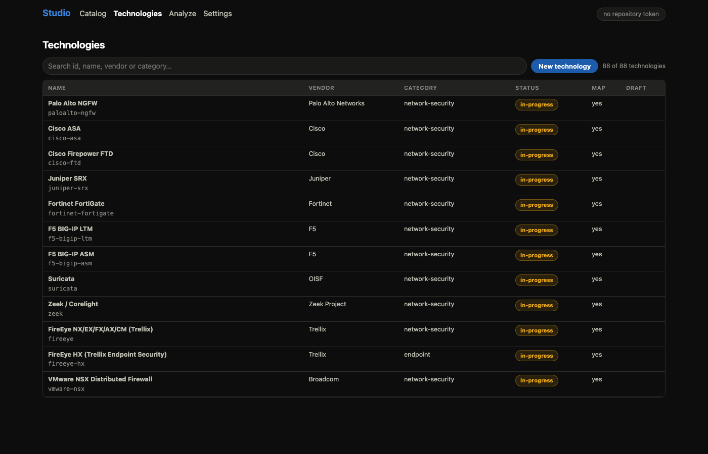

# Add a technology

From "I own a device" to a merge request someone can review. Twenty
minutes, no YAML, no git.

## Before you start

You need an account on the repository and a personal access token with
write access. You do not need to clone anything.

Put the token in before you start, not when you need it: press
**Settings** in the header, paste it into **Repository token**, and press
**Save**. Tick **Remember on this device** if this is your own machine —
without it the token lives only until the tab closes. **Create merge
request** stays disabled until a token is stored, and that is at the end
of the walkthrough, which is a long way to get before finding out.

## 1. Open Studio and claim the id

Open the site, press **Studio** in the header, then **Technologies**. The
search box filters the whole catalog — check your technology is not
already there under another name.

Press **New technology** and type an id: lower case, digits and hyphens,
usually vendor-and-product like `cisco-asa`. It becomes the filename and
**cannot be changed later**, so read it twice. Press **Create**.

## 2. Fill in the technology

Name, vendor and the versions this map was written against. Add a
reference for every claim you are about to make — vendor documentation,
not memory. Tick **Draft** — a new technology starts with the box clear, and
what the flag means is in the README's [statuses and lifecycle][statuses].

Then fill the **Catalog row** panel, which is what puts your technology on
the index page: name, vendor, **Category**, **Status** and **Priority**.
Category starts empty and **Review changes** stays disabled until it is
set. Status starts at `planned`; set it to `in-progress` once the map has
real content, or a finished map publishes as though nobody has started it.

## 3. Add a dataset per kind of log

One dataset per kind of log, not one per file. A firewall's traffic log
and threat log are two datasets. Give each the event categories it
carries — those decide which alerting-required fields appear in the field
table, so choosing them wrongly makes the coverage numbers wrong.

## 4. Describe the route

Say whether the dataset crosses the guard, and give the hops it takes.
Most datasets have both a guarded and a direct side, and those are
separate feeds rather than a choice; a dataset that never crosses the
guard has only *direct*. The README explains that distinction in
[route portrayal and the guard][route].

## 5. Fill the field table

One row per vendor field: its name as the device emits it, its type, what
it means, and the ECS field it maps to. Where nothing in ECS fits, leave
the ECS target empty, set the status to `unmapped` and name a custom
field — a field with nowhere to go is worth recording, and silently
dropping it is not.

What the statuses mean, and when a partial mapping is the honest answer,
is in the README's [mapping status][status].

## 6. Review and open the merge request

Press **Review changes**. Studio lists every change and every file it will
write; the diff itself is on the merge request. Press through to open it.

If the repository cannot be reached from your browser, Studio falls back
to giving you the file contents to apply by hand — see
[Troubleshooting](Troubleshooting).

## What happens next

CI re-validates everything. A reviewer checks the mapping evidence against
the references you gave. When it merges, the site rebuilds and your
technology has a page.

The rules a reviewer will hold it to are in the README's
[contributing][contributing] section.

[route]: {{REPO}}/README.md#route-portrayal-and-the-guard
[status]: {{REPO}}/README.md#mapping-status
[statuses]: {{REPO}}/README.md#statuses-and-lifecycle
[contributing]: {{REPO}}/README.md#contributing
